# Testing

> [!NOTE]
> Return back to the [README.md](README.md) file.

## Code Validation

### HTML

I have used the recommended [HTML W3C Validator](https://validator.w3.org) to validate all of my HTML files.

| Directory | File                                                                            | URL                                                                                                     | Screenshot                                                   | Notes                 |
| --------- | ------------------------------------------------------------------------------- | ------------------------------------------------------------------------------------------------------- | ------------------------------------------------------------ | --------------------- |
|           | [404.html](https://github.com/twitch10126/the-forge/blob/main/404.html)         | [HTML Validator](https://validator.w3.org/nu/?doc=https://twitch10126.github.io/the-forge/404.html)     | 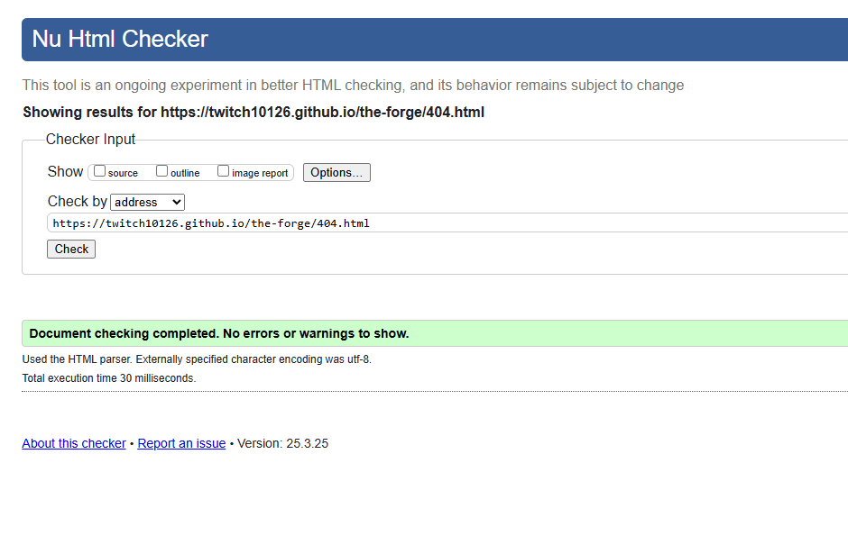     | Notes (if applicable) |
|           | [booking.html](https://github.com/twitch10126/the-forge/blob/main/booking.html) | [HTML Validator](https://validator.w3.org/nu/?doc=https://twitch10126.github.io/the-forge/booking.html) |  | Notes (if applicable) |
|           | [classes.html](https://github.com/twitch10126/the-forge/blob/main/classes.html) | [HTML Validator](https://validator.w3.org/nu/?doc=https://twitch10126.github.io/the-forge/classes.html) | 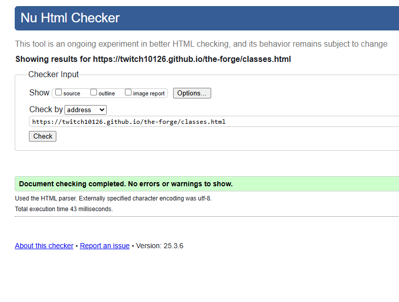 | Notes (if applicable) |
|           | [gallery.html](https://github.com/twitch10126/the-forge/blob/main/gallery.html) | [HTML Validator](https://validator.w3.org/nu/?doc=https://twitch10126.github.io/the-forge/gallery.html) |  | Notes (if applicable) |
|           | [index.html](https://github.com/twitch10126/the-forge/blob/main/index.html)     | [HTML Validator](https://validator.w3.org/nu/?doc=https://twitch10126.github.io/the-forge/index.html)   | 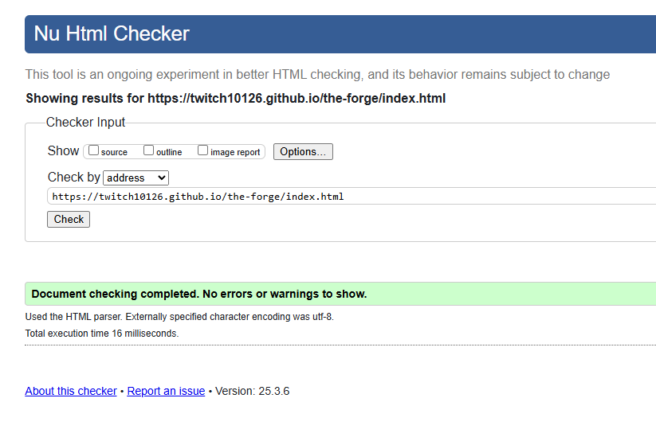   | Notes (if applicable) |
|           | [signup.html](https://github.com/twitch10126/the-forge/blob/main/signup.html)   | [HTML Validator](https://validator.w3.org/nu/?doc=https://twitch10126.github.io/the-forge/signup.html)  |   | Notes (if applicable) |
|           | [success.html](https://github.com/twitch10126/the-forge/blob/main/success.html) | [HTML Validator](https://validator.w3.org/nu/?doc=https://twitch10126.github.io/the-forge/success.html) | 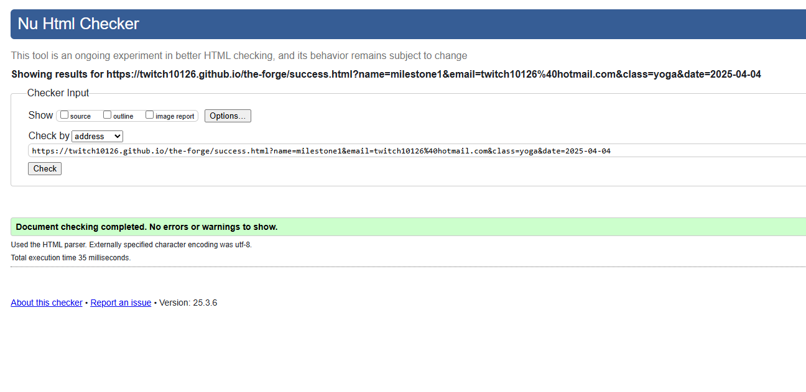 | Notes (if applicable) |

### CSS

I have used the recommended [CSS Jigsaw Validator](https://jigsaw.w3.org/css-validator) to validate all of my CSS files.

| Directory | File                                                                                 | URL                                                                                                        | Screenshot                                               | Notes                 |
| --------- | ------------------------------------------------------------------------------------ | ---------------------------------------------------------------------------------------------------------- | -------------------------------------------------------- | --------------------- |
| assets    | [style.css](https://github.com/twitch10126/the-forge/blob/main/assets/css/style.css) | [CSS Validator](https://jigsaw.w3.org/css-validator/validator?uri=https://twitch10126.github.io/the-forge) |  | Notes (if applicable) |

## Responsiveness

I've tested my deployed project to check for responsiveness issues.

| Page    | Mobile                                                                                                                                                                                                                                                      | Tablet                                                                                                                                                                                                                                                      | Desktop                                                                                                                                                                                                                                                         | Notes             |
| ------- | ----------------------------------------------------------------------------------------------------------------------------------------------------------------------------------------------------------------------------------------------------------- | ----------------------------------------------------------------------------------------------------------------------------------------------------------------------------------------------------------------------------------------------------------- | --------------------------------------------------------------------------------------------------------------------------------------------------------------------------------------------------------------------------------------------------------------- | ----------------- |
| Home    |   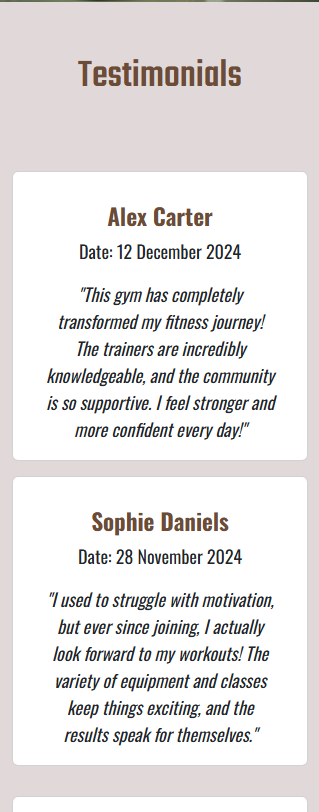  |   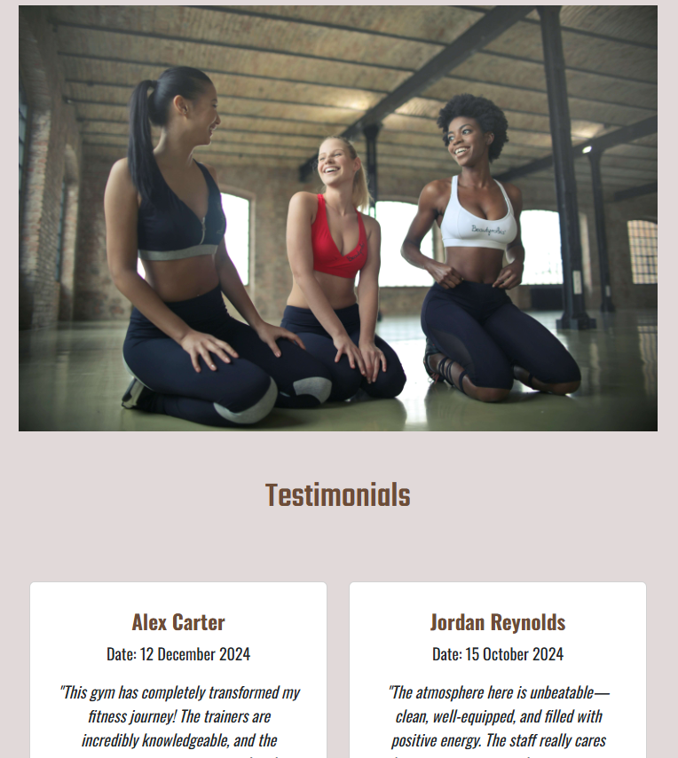  |  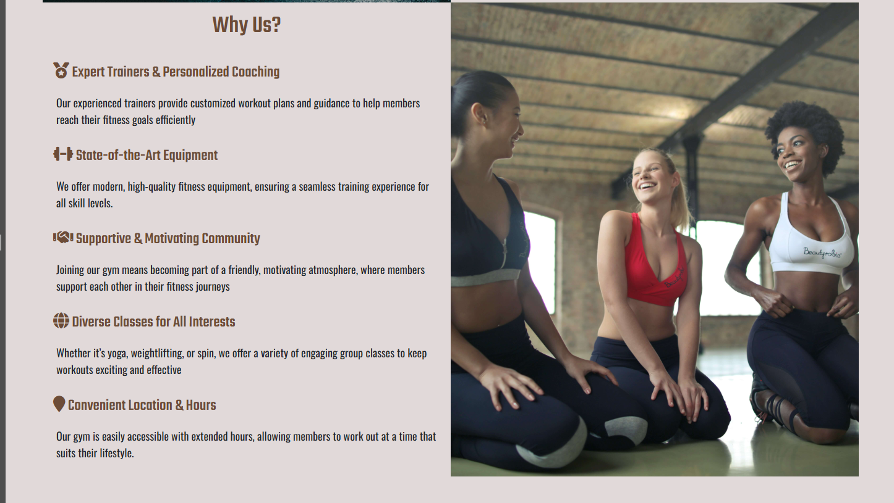   | Works as expected |
| Gallery |                                                                                                                             |                                                             |                                                                                                                                                                                                | Works as expected |
| Signup  |                                                                                                                                                                                                |                                                                                                                                                                                                |                                                                                                                                                                                                   | Works as expected |
| Success | 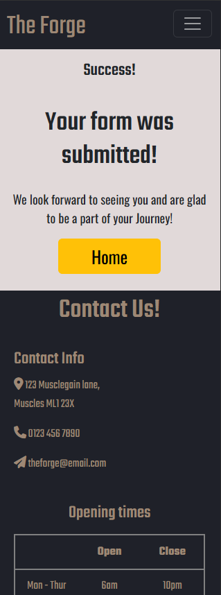                                                                                                                                                                                              |                                                                                                                                                                                               |                                                                                                                                                                                                  | Works as expected |
| 404     | 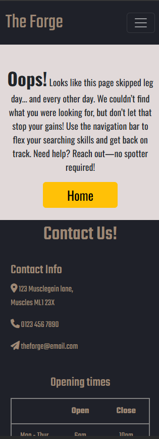                                                                                                                                                                                                  | 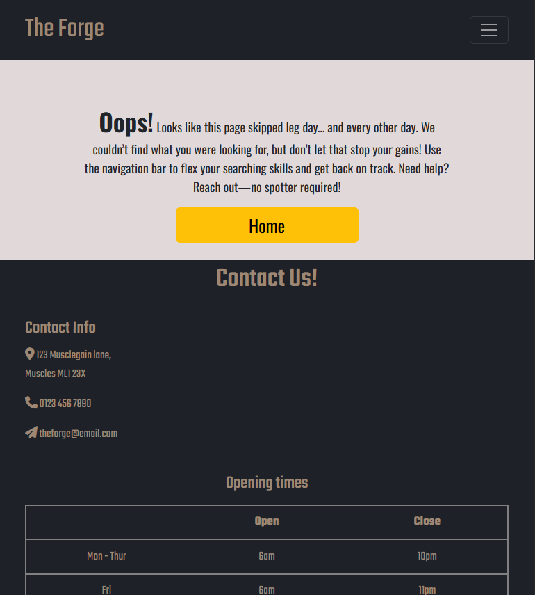                                                                                                                                                                                                  | 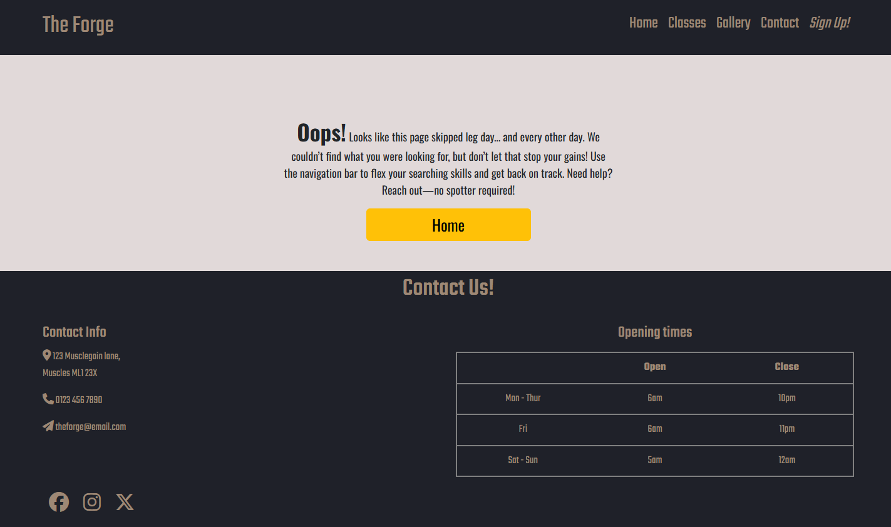                                                                                                                                                                                                     | Works as expected |
| Booking |                                                                                                                                                                                               |                                                                                                                                                                                               |                                                                                                                                                                                                  | Works as expected |
| Classes |                                                                                                                             |                                                             |                                                                                                                               | Works as expected |

## Browser Compatibility

| Page    | Chrome                                                   | Firefox                                                   | Microsoft Edge                                         | Notes             |
| ------- | -------------------------------------------------------- | --------------------------------------------------------- | ------------------------------------------------------ | ----------------- |
| Home    |     |     |     | Works as expected |
| Gallery |  |  |  | Works as expected |
| Classes |  |  |  | Works as expected |
| Signup  |   | 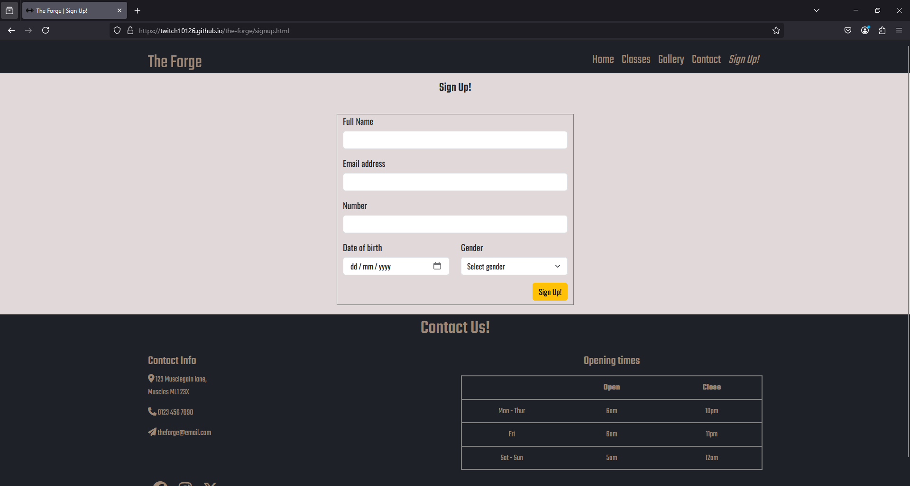  |   | Works as expected |
| Booking |  |  |  | Works as expected |
| Success |  |  |  | Works as expected |
| 404     |      |      |      | Works as expected |

## Lighthouse Audit

I've tested my deployed project using the Lighthouse Audit tool to check for any major issues. Some warnings are outside of my control, and mobile results tend to be lower than desktop.

| Page    | Mobile                                                     | Desktop                                                     |
| ------- | ---------------------------------------------------------- | ----------------------------------------------------------- |
| Home    |     |     |
| Gallery |  |  |
| Signup  |   |   |
| Success |  |  |
| 404     |      |      |
| Classes |  | 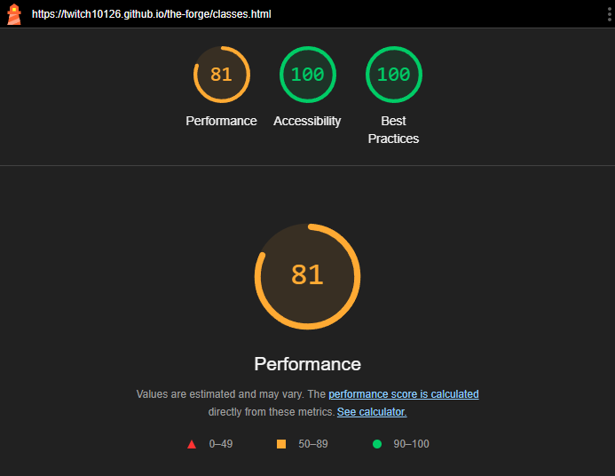 |
| Booking |  |  |

## Defensive Programming

Defensive programming was manually tested with the below user acceptance testing:

| Page           | Expectation                                                                                              | Test                                                                                                             | Result                                                                           | Screenshot                                                                                                                                                                       |
| -------------- | -------------------------------------------------------------------------------------------------------- | ---------------------------------------------------------------------------------------------------------------- | -------------------------------------------------------------------------------- | -------------------------------------------------------------------------------------------------------------------------------------------------------------------------------- |
| Home           | Feature is expected to display examples of why users should join.                                        | Verified that the page displays the gyms mission and purpose in a clear and concise manner.                      | The mission and purpose were displayed as expected.                              |                                                                                                                                   |
|                | Feature is expected to have accessible navigation links.                                                 | Checked navigation links for correct functionality and accessibility.                                            | Navigation links were functional and accessible.                                 |                                                                                                                             |
|                | Feature is expected to be fully responsive.                                                              | Resized the browser window and tested on multiple devices (mobile, tablet, desktop).                             | The page was responsive across all tested screen sizes.                          |    |
| Schedule       | Feature is expected to show the Classes schedule for sessions.                                           | Confirmed that the page contains a structured table with session duration, difficulty level and available slots. | Schedule was displayed as expected.                                              |                                                                                                                               |
| Classes        | Feature is expected to display details of all available classes.                                         | Verified that the page lists all classes with relevant details.                                                  | class details were displayed as expected.                                        |                                                                                                                                |
| Gallery        | Feature is expected to showcase a gallery of equipment and gym activities.                               | Verified that the gallery contains clear images that aren't stretched, and fully responsive.                     | Images are properly sized, and respond well to different device sizes.           |                                                               |
| Sign-Up Form   | Feature is expected to prevent submission of an empty form.                                              | Attempted to submit the form without filling any fields.                                                         | Form submission was blocked, as expected.                                        |                                                                                                                              |
| Booking Form   | Feature is expected to prevent submission of an empty form.                                              | Attempted to submit the form without filling any fields.                                                         | Form submission was blocked, as expected.                                        |                                                                                                                             |
|                | Feature is expected to enforce valid input types for each field.                                         | Entered invalid data (e.g., random text in an email field, numbers in a name field, etc.).                       | Error messages were displayed appropriately, and submission was blocked.         |                                                                                                                             |
| Social Links   | Feature is expected to include working links to the club’s social platforms (Instagram, Facebook, etc.). | Clicked each social link to verify redirection to the correct platform page.                                     | All links redirected to the correct platform pages, opening in new browser tabs. |                                                                                                                                 |
| 404 Error Page | Feature is expected to display a 404 error page for non-existent pages.                                  | Navigated to an invalid URL (e.g., `/test`) to test error handling.                                              | A custom 404 error page was displayed as expected.                               |                                                                                                                                    |
| Success Page   | Feature is expected to display a success page once a form has been successfully submitted.               | Correctly filled out and submitted form.                                                                         | A custom success page was displayed as expected.                                 |                                                                                                                                |
